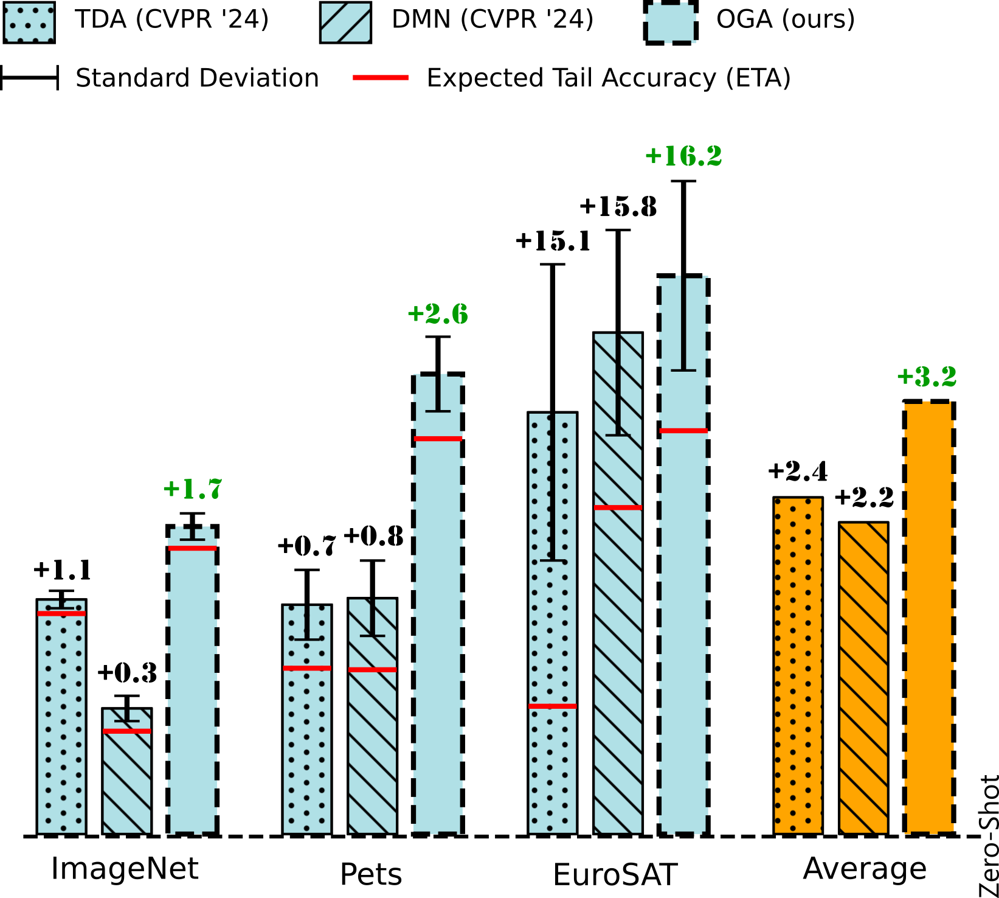

# Online Gaussian Adaptation of Vision-Language Models (OGA)
The official repository of the paper [*Online Gaussian Adaptation of Vision-Language Model*]().

Authors:
[Clément Fuchs*](https://scholar.google.com/citations?user=ZXWUJ4QAAAAJ&hl=fr&oi=ao),
[Maxime Zanella*](https://scholar.google.com/citations?user=FIoE9YIAAAAJ&hl=fr&oi=ao),
[Christophe De Vleeschouwer](https://scholar.google.com/citations?user=xb3Zc3cAAAAJ&hl=fr&oi=ao).

*Denotes equal contribution

## Overview

**OGA** is an online adaptation method which builds a cache of samples with low zero-shot entropy along a data stream. This cache is then used to build a multivariate Gaussian model of the class conditional likelihoods of the observed features, finally computing updated predictions using a pseudo-bayesian Maximum A Posteriori (MAP) estimator. Main results averaged over 11 datasets are summarized in the 2 Tables below.

| W/ standard prompts         | **ViT-B/16** | **ViT-B/32** | **ViT-L/14** | **ResNet50** | **ResNet101** |
|----------------------|--------------|--------------|--------------|--------------|---------------|
| Zero-Shot       | 65.3         | 61.9         | 72.6         | 58.7         | 59.5          |
| TDA             | 67.7 `↑2.4`  | 62.3 `↑0.4`  | 73.5 `↑0.9`  | 59.3 `↑0.6`  | 60.6 `↑1.1`   |
| DMN             | 67.5 `↑2.2`  | 61.8 `↓0.1`  | 73.7 `↑1.1`  | 58.6 `↓0.1`  | 61.0 `↑1.5`   |
| **OGA (ours)**      | **68.5 `↑3.2`**  | **62.9 `↑1.0`**  | **74.3 `↑1.7`**  | **59.8 `↑1.1`**  | **61.6 `↑2.1`**   |


| W/ custom prompts          | **ViT-B/16** | **ViT-B/32** | **ViT-L/14** | **ResNet50** | **ResNet101** |
|----------------------|--------------|--------------|--------------|--------------|---------------|
| Zero-Shot       | 65.6         | 61.4         | 72.2         | 57.4         | 59.0          |
| TDA             | 66.9 `↑1.3`  | 62.3 `↑0.9`  | 73.9 `↑1.7`  | 58.1 `↑0.7`  | 59.4 `↑0.4`   |
| DMN             | 66.4 `↑0.8`  | 61.6 `↑0.2`  | 74.4 `↑2.2`  | 57.2 `↓0.2`  | 60.3 `↑1.3`   |
| **OGA (ours)**      | **67.3 `↑1.7`**  | **62.8 `↑1.4`**  | **74.7 `↑2.5`**  | **58.4 `↑1.0`**  | **60.6 `↑1.6`**   |

Additionally, we advocate for more rigorous evaluation practices, including increasing the number of runs and considering additional quantitative metrics, such as our proposed Expected Tail Accuracy (ETA), calculated as the average accuracy in the worst 10% of runs. See illustration below.

<p align="center">
  
  <br>
  <em>Figure 1. The presented results are averaged over 100 runs. We propose the Expected Tail Accuracy (ETA), i.e., the average over the 10% worst runs, in solid red line. Our method named OGA not only significantly outperforms competitors on average but also has an ETA exceeding their average accuracy on several datasets (e.g., ImageNet and Pets). See our paper [TODO](https://arxiv.org/)</em>
</p>

The repository also includes a lightweight implementation of [TDA](https://openaccess.thecvf.com/content/CVPR2024/html/Karmanov_Efficient_Test-Time_Adaptation_of_Vision-Language_Models_CVPR_2024_paper.html) and [DMN](https://openaccess.thecvf.com/content/CVPR2024/html/Zhang_Dual_Memory_Networks_A_Versatile_Adaptation_Approach_for_Vision-Language_Models_CVPR_2024_paper.html) for training free / zero-shot adaptation without test-time augmentations. OGA exhibits strong performances, shown as averages over 11 datasets for 5 different architectures in the following table.


## Dependencies
The repository is dependent on [PyTorch](https://pytorch.org/) and [openai-clip](https://pypi.org/project/openai-clip/).
## Datasets
Please follow [DATASETS.md](DATASETS.md) to install the datasets.
You will get a structure with the following dataset names:
```
$DATA/
|–– caltech-101/
|–– oxford_pets/
|–– stanford_cars/
|–– oxford_flowers/
|–– food-101/
|–– fgvc_aircraft/
|–– sun397/
|–– dtd/
|–– eurosat/
|–– ucf101/
|–– imagenet/
```
## Running benchmarks
### Computing and storing features
The benchmarks are run using pre-computed features, as none of the available methods update the vision encoder. 
First, use compute_features.py to compute and store features and labels.
Example : 
```bash
python compute_features.py  --data_root_path "E:/DATA" --backbone "vit_b16" --datasets 'sun397' 'imagenet' 'fgvc_aircraft' 'eurosat' 'food101' 'caltech101' 'oxford_pets' 'oxford_flowers' 'stanford_cars' 'dtd' 'ucf101'
```
/!\ Warning: The above command line overwrites previous features for the current architecture.
The features and targets are stored in a "cache" subfolder within each dataset folder. It should look like
```
$DATA/
|–– caltech-101/
  |--cache/
|–– oxford_pets/
  |--cache/
|–– stanford_cars/
  |--cache/
...
```

### Benchmarks
Results presented in our paper can be reproduced using main.py. Results are stored in a .json (for quantitites such as average batch accuracy per dataset) and a .pickle (for detailed results such as accuracy per batch), at $DATA/results/.
The randomness is controlled by the parameters --master_seed and --n_runs. For a same tuple of (master_seed, n_runs), the runs generated are always the same. Note that you may still observe slight variations in results depending on your CUDA and PyTorch versions or hardware specifications.
Example :
```bash  
python main.py --data_root_path "E:/DATA" --adapt_method_name "TDA" --datasets 'sun397' 'imagenet' 'fgvc_aircraft' 'eurosat' 'food101' 'caltech101' 'oxford_pets' 'oxford_flowers' 'stanford_cars' 'dtd' 'ucf101'
```

## Citation

If you find this repository useful, please consider citing our paper:
```
@article{
}
```

## Contact

For any inquiries, please contact us at [clement.fuchs@uclouvain.be](mailto:clement.fuchs@uclouvain.be) and  [maxime.zanella@uclouvain.be](mailto:maxime.zanella@uclouvain.be) or feel free to [create an issue](https://github.com/cfuchs2023/OGA/issues).

## Acknowledgment
This repository is mainly based on [CLIP](https://github.com/openai/CLIP) and [TransCLIP](https://github.com/MaxZanella/transduction-for-vlms). 

